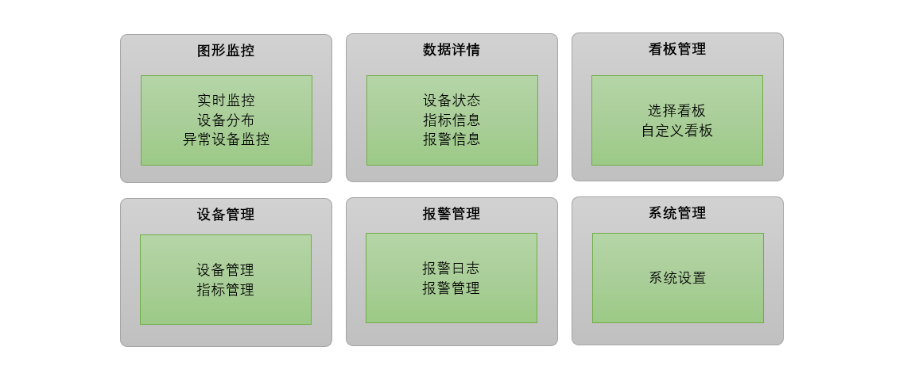
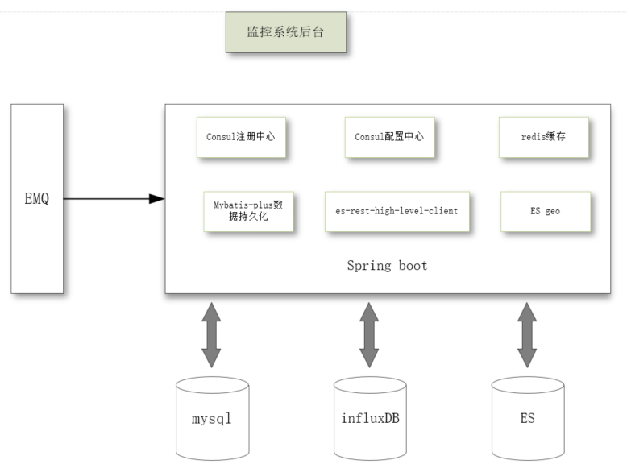

# CockRoachIOT

### 1、首先来说为什么要重新找一遍轮子呢？理由如下：

（1）从规模角度来说：我国物联网发展速度较全球平均水平更快。全球物联网产业规模自 2008 年500亿美元增长至 2018 年仅 1510  亿美元，年均复合增速达 11.7%。我国物联网产业规模2017年达 11500亿元，自 2011 年起进一步加速，2009-2017  年均复合增速达 26.9%，

（2）从行业渗透角度来说：全球物联网行业渗透率 2013、2017 分别达  12%、29%，提升一倍多，预计2020年有超过 65%企业和组织将应用物联网产品和方案。近年来，我国物联网市场规模不断扩大，2012年的  3650 亿元增长到 2017 年的 11605 亿元，年复合增长率高达 25%。 

 2012-2017年我国物联网市场规模（亿元） 

 全球物联网渗透率变化 

### 2.1 技术架构

​	核心功能列表：

​	（1）报文数据采集与指标解析 ：整个系统的数据来源是通过接收设备发送过来的报文消息，在系统中定义主题和消息内容字段的指标数据为过滤条件，从而对消息进行收集和分析。

​	（2）报警监控  ： 通过和系统中定义的各种告警级别数据进行对比，一旦发现触发到告警级别的消息，就会通过和告警关联配置的webhook来将告警信息透传到其它系统

​        （3）GPS定位监控 ：采集每台设备的GPS定位，并提供设备位置查询功能。

​        （4）数据看板 :   提供丰富的自定义数据看板。

### 2.2 业务架构

从上图我们可以看到，真个系统从业务上分为6大功能模块：图形监控模块、数据详情展示模块、看板管理模块、设备管理模块、报警管理模块、系统管理模块。

### 2.3 系统架构

整个系统的技术架构图如下：

预制数据将放入MySQL里进行存储，设备上报的指标数据包括告警数据将存入influxDB中，设备的地理位置信息数据存入到ES中以便后期搜索。为了提高系统的运行稳定性，有些频繁访问的数据储存在redis中，因为考虑到设备上报的数据是非常频繁的，如果单单只依靠MySQL数据库的话，会很容易将MySQL服务器的CPU的占用率搞到100%，从而会引发整个系统的崩溃无法使用。

一些基本的配置放入到了consul的配置中心，考虑到系统的横向扩展能力，将整个系统基于Consul做注册中心来搭组建一个微服务。

### 2.4 数据库设计

mysql数据库有5个表：

**管理员表tb_admin**

| 列名         | 数据类型        | 说明                         |
| ---------- | ----------- | -------------------------- |
| id         | int         | 表主键id，自增                   |
| login_name | varchar(50) | 登录账号                       |
| password   | varchar(60) | 密码                         |
| type       | tinyint     | 类型 1:超级管理员 2:普通用户 目前作为保留字段 |
| board      | varchar(50) | 看板列表                       |

**指标配置表tb_quota**

| 列名              | 数据类型          | 说明                            |
| --------------- | ------------- | ----------------------------- |
| id              | int           | 表主键id                         |
| name            | varchar(50)   | 指标名称                          |
| unit            | varchar(20)   | 指标单位                          |
| subject         | varchar(50)   | 报文主题                          |
| value_key       | varchar(50)   | 指标值字段                         |
| sn_key          | varchar(50)   | 设备识别码字段                       |
| webhook         | varchar(1000) | web钩子                         |
| value_type      | varchar(10)   | 指标字段类型，Double、Inteter、Boolean |
| reference_value | varchar(100)  | 参考值                           |

**报警配置表tb_alarm**

| 列名        | 数据类型          | 说明             |
| --------- | ------------- | -------------- |
| id        | int           | 表主键id，自增       |
| name      | varchar(50)   | 报警指标名称         |
| quota_id  | int           | 关联指标名称         |
| operator  | varchar(10)   | 运算符            |
| threshold | int           | 报警阈值           |
| level     | int           | 报警级别 1：一般 2：严重 |
| cycle     | int           | 沉默周期(以分钟为单位)   |
| webhook   | varchar(1000) | web钩子地址        |

**面板配置表tb_board**

| 列名       | 数据类型         | 说明       |
| -------- | ------------ | -------- |
| id       | int          | 表主键id，自增 |
| admin_id | int          | 管理员id    |
| name     | varchar(50)  | 看板名称     |
| quota    | varchar(100) | 指标       |
| device   | varchar(100) | 设备       |
| system   | tinyint      | 是否是系统看板  |
| disable  | tinyint      | 是否不显示    |

**GPS配置表tb_gps**

| 列名         | 数据类型        | 说明          |
| ---------- | ----------- | ----------- |
| id         | bigint      | 表主键id       |
| subject    | varchar(50) | 报文主题        |
| sn_key     | varchar(50) | 设备识别码字段     |
| type       | tinyint     | 类型（单字段、双字段） |
| value_key  | varchar(50) | 经纬度字段       |
| separation | varchar(10) | 经纬度分隔符      |
| longitude  | varchar(20) | 经度字段        |
| latitude   | varchar(20) | 维度字段        |

